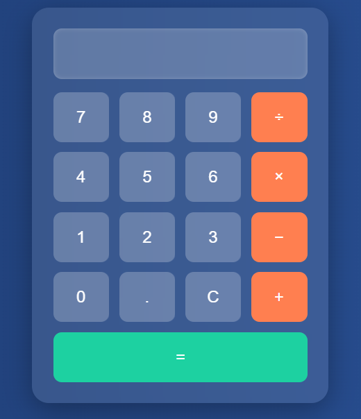

# 🔢 Interactive Calculator Web App

A fully functional and interactive calculator built using HTML, CSS, and JavaScript. This project demonstrates DOM manipulation, event handling, keyboard support, and basic arithmetic operations.

## 🚀 Features

- Responsive UI with glass effect styling
- Support for keyboard and mouse inputs
- Basic operations: Addition, Subtraction, Multiplication, Division
- Error handling for invalid expressions
- Clear button to reset input

## 🎯 Technologies Used

- HTML5
- CSS3 (with modern effects)
- Vanilla JavaScript

## 📸 Preview



## 🧠 How It Works

- Click or press keys to input numbers/operators
- `=` or `Enter` to calculate
- `C` or `c` to clear
- `Backspace` to delete

## 💡 Learning Concepts

- DOM Manipulation
- Event Listeners
- Input Parsing
- UI/UX Styling with CSS
- Keyboard Input Handling

## 🛠️ Installation

```bash
# Clone the repo
git clone https://github.com/Tejaswimadastu/SCT_WD_2.git

# Open index.html in your browser

File Structure

calculator-web-app/
│
├── index.html       # Main HTML page
├── style.css        # Styling
├── script.js        # JavaScript functionality
└── README.md        # Project documentation
Live Preview at 

https://tejaswimadastu.github.io/SCT_WD_2/